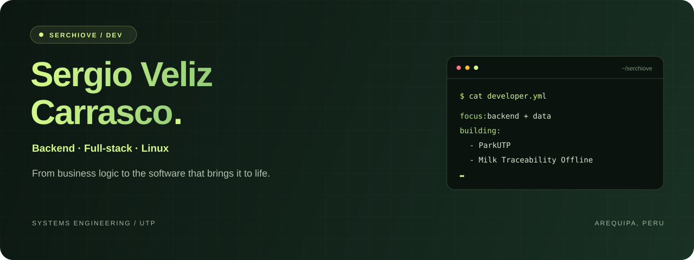
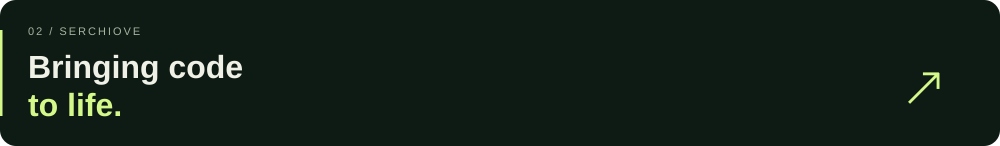
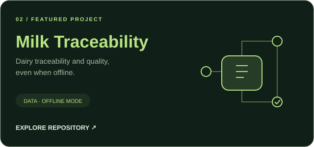
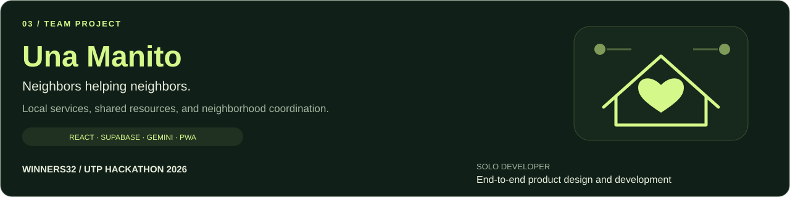

  

 &nbsp;
 &nbsp;
 &nbsp;
 &nbsp;

  

**I build software for real operational workflows.**

My work spans offline data capture, secure APIs, and full-stack applications, with a focus on the logic and data behind them.

 

<h2></h2>

I’m **Sergio**, a **Systems Engineering student at UTP in Arequipa**. I build practical software by understanding the workflow, modeling its data, and implementing the backend logic that supports it.

My main interests are **backend engineering, software architecture, and databases**, especially for logistics and operational systems. I also work across the stack and explore Linux environments.

 

<h2></h2>

<strong>ParkUTP · Academic team project (APF2)</strong> Manage campuses and parking areas, record entries and exits, and track occupancy and history.  Java 21 · Spring Boot · PostgreSQL · JWT · JSP/JSF

<strong>ACOPIO · Academic project</strong> Offline-capable milk intake with server-side quality checks, tank assignment, traceability, and reporting. The integrated Android and dashboard workflow has been verified; the project uses fictional data.  Flutter · Dart · Spring Boot · PostgreSQL · React/Vite

  

I created Una Manito, from product design and the React application to Supabase integration, Gemini-assisted publishing, PWA support, and deployment. The app connects neighbors with local services and shared resources, supports emergency coordination, and publishes neighborhood alerts after human review.

**[View the team repository ↗](https://github.com/Melissa-1217/una-manito-app)**

  

### More problems, more ways to build

| Project | What I explore | Area |
| :--- | :--- | :--- |
| **[Velcar](https://github.com/serchiove/velcar-ecommerce-platform)** | E-commerce connected with logistics and distribution. | E-Commerce |
| **[BusTrack](https://github.com/serchiove/BusTrack)** | Digitizing public transport routes in Arequipa. | Next.js · MVP |
| **[UTP-Marketplace](https://github.com/serchiove/UTP-Marketplace)** | A REST API for a marketplace with relational persistence. | Java · Spring Boot · PostgreSQL |
| **[Python Report Generator](https://github.com/serchiove/python-report-generator)** | Data extraction and dynamic report generation. | Python · Automation |
| **[Free Throw 3D](https://github.com/serchiove/Simulador-Tiros-Libres-3D)** | Bringing physics and the Magnus effect to a web simulation. | Physics · Web · 3D |
| **[GameFlow Simulator](https://github.com/serchiove/GameFlow-Simulator)** | Building desktop graphical interfaces. | Java · Swing |

 

<h2></h2>

<table align="center" width="90%">
<tr>
<td width="50%" valign="top">
<h3>Backend &amp; Data</h3>

Business logic, APIs, and persistence.

Java · Spring Boot · Python · PostgreSQL · MySQL

</td>
<td width="50%" valign="top">
<h3>Frontend</h3>

Interfaces that connect with the backend.

TypeScript · JavaScript · Next.js · Angular

</td>
</tr>
<tr>
<td valign="top">
<h3>Systems &amp; Tools</h3>

The environment where ideas take shape.

Linux · Ubuntu · Git

</td>
<td valign="top">
<h3>Personal Lab</h3>

Experimenting is part of the process.

<code>Minecraft Forge</code> <code>Modding</code>

<code>Physics simulation</code> <code>Java Swing</code>

</td>
</tr>
</table>

 

<h2></h2>

There’s more to life than the terminal.

- **In my headphones:** Spanish-language rock, alternative, pop punk, and classic reggae.
- **In my games:** tactical FPS games, MOBAs, sandbox games, and modding.
- **On the pitch:** Real Madrid and Fede Valverde. Hala Madrid!
- **By my keyboard:** Chocho, my tuxedo cat and coding companion. 🐈‍⬛

 
 

---

 

<h2></h2>

Let’s talk about software, technology, or whatever you’re building.

  

 

AREQUIPA, PERU &nbsp; · &nbsp; SERCHIOVE

